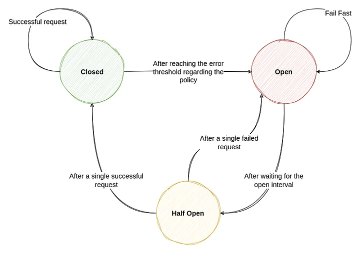

### Circuit Breaker

- The circuit breaker pattern is a design pattern that allows a microservice to fail fast when a dependent service is down.

- This is done by wrapping the call to the dependent service in a circuit breaker object.

- The circuit breaker object monitors the number of failed calls to the dependent service and when the number of failed calls exceeds a certain threshold, the circuit breaker is tripped and all subsequent calls to the dependent service are rejected.

- This prevents the dependent service from being overwhelmed by requests when it is down and allows the microservice to fail fast and return an error to the client.

 

